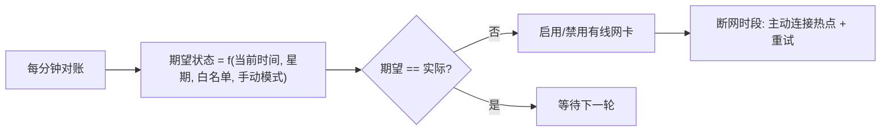
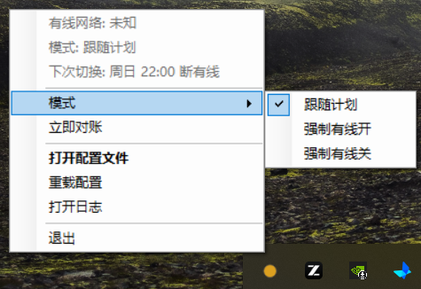

# NetScheduler

> 校园网定时断网自动切换工具：断网时段自动禁用有线网卡、秒连手机热点，恢复时段自动还原有线。
> A tiny Windows tray utility that auto-disables the wired NIC during scheduled campus-network blackout hours, switches to your phone hotspot, and restores the wired connection afterwards.


## 背景

很多学校的"断网"并不是掐断网线信号，而是**不通过网络认证**。于是有线网卡依然"在线"，
Windows 始终认为有线网可用：你打开手机热点，它不肯自动切过去；手动连上热点，流量也还是
优先走有线，浏览器里弹出来的永远是校园网认证失败页面。

NetScheduler 的解法很直接——**到点直接禁用有线网卡**。网卡一禁用，Windows 就认为有线网
"物理消失"，系统自带的自动连接机制立刻接管，再也不会弹出认证页；到了恢复时刻再启用网卡，
一切还原。

## 特性

- ⏰ **定时切换**：可配置星期（默认周日~周四）+ 断网/恢复时刻（默认 22:30 / 05:00）
- 🔌 **开机自启**：通过计划任务以最高权限登录自启（无 UAC 弹窗），启动时按当前时间自动纠正状态（晚上关机、第二天开机也不会忘）
- 🔁 **状态对账引擎**：每分钟核对"期望状态 vs 网卡实际状态"，不一致即自动纠正——睡眠错过时间点唤醒后补判、网卡被外部改动后自愈，全靠这一个机制
- 🎛️ **两级控制**：托盘菜单可切换**自动/手动**控制模式并持久化（重启保持）——自动=按计划调度、可临时强制并到点恢复跟随；手动=完全手动不自动切换，还可选"每次开机启用有线"
- 🛟 **网卡名漂移自愈**：配置的网卡不存在时（USB 共享拔出、设备名变化）自动回退到检测到的有线网卡并弹泡提示
- 📶 **热点秒连**：断网时主动连接指定热点并带重试；断网时段内热点掉线每分钟自动重连
- 🏖️ **白名单**：假期日期（支持单日与日期区间）不执行断网
- 🖱️ **托盘菜单**：实时状态、下次切换时间、手动强制开/关，勾选状态与真实状态实时同步
- 📝 **配置热更新**：INI 配置带中文注释，保存即自动生效；网卡名与热点名支持自动检测写回
- 🪶 **极低占用**：单文件 exe 约 38 KB，常驻内存约 30~40 MB，CPU 占用≈0（每分钟一次毫秒级对账），无需安装任何运行库（.NET Framework 4.8 为 Windows 内置）

## 工作原理

程序不做简单的定时，而是把所有场景统一成一个**状态对账**循环：



它同时覆盖了：定时断/恢复、开机按时间抉择、睡眠唤醒补判、外部状态篡改自愈。

## 快速开始

### 1. 获取程序

**方式 A（推荐）**：到 [Releases](../../releases) 页面下载 `NetScheduler-v1.0.3.zip`（内含主程序与一键安装/卸载脚本），解压后按下面步骤安装。仅下载单个 `NetScheduler.exe` 也能运行（.NET Framework 4.8 为 Windows 内置），但不会注册开机自启，需每次开机后手动启动。

**方式 B（从源码构建）**：克隆或下载本仓库，双击 `build.bat`。构建使用 Windows 自带的
C# 编译器（.NET Framework 4.x），**无需安装任何 SDK 或运行库**。

### 2. 一次性准备

打开手机热点 → 电脑连接它 → 勾选"自动连接"（只需一次；程序之后也会自动检测热点名）。

### 3. 安装

右键 `install.bat` → **以管理员身份运行**。它会：

- 把程序复制到 `%LOCALAPPDATA%\NetScheduler`
- 注册一个"登录时以最高权限自启"的计划任务，全程无 UAC 弹窗
- 立即启动程序，托盘出现绿/红圆点图标

升级版本时重复运行一次 `install.bat` 即可（会覆盖 exe、保留你已有的 config.ini）。

### 4. 配置

编辑 `%LOCALAPPDATA%\NetScheduler\config.ini`（首次运行会自动生成默认配置），
修改保存后**自动生效**。`EthernetName` 与 `WifiProfile` 都可以留空——程序检测到后会
自动写回。

卸载：以管理员身份运行 `uninstall.bat`。

## 配置说明

### [Schedule]

| 参数 | 默认 | 说明 |
| --- | --- | --- |
| `OffDays` | `0,1,2,3,4` | 断网生效的星期。0=周日，1=周一 … 6=周六 |
| `OffTime` | `22:30` | 该时刻起禁用有线网卡（进入断网时段） |
| `OnTime` | `05:00` | 该时刻起重新启用有线网卡（离开断网时段） |

### [Network]

| 参数 | 默认 | 说明 |
| --- | --- | --- |
| `EthernetName` | 空 | 有线网卡的连接名（"网络连接"面板里的名字）。留空=自动检测并写回；配置的网卡消失时自动回退到检测结果 |
| `WifiProfile` | 空 | 热点的 Wi-Fi 配置文件名，一般就是热点 SSID。留空=检测到连接时自动写回；填上可获得断网秒连与掉线自愈 |
| `ConnectRetries` | `5` | 断网时主动连热点的重试次数 |
| `RetryIntervalSec` | `30` | 每次重试的间隔秒数 |

### [Whitelist]

| 参数 | 默认 | 说明 |
| --- | --- | --- |
| `Whitelist` | 空 | 白名单日期，全天不执行断网。逗号分隔，支持单日 `2026-01-01` 与区间 `2026-01-20..2026-02-24` |

### [Behavior]

| 参数 | 默认 | 说明 |
| --- | --- | --- |
| `ManualExpiresNextEvent` | `true` | 自动模式下，手动强制开/关在下一个定时点自动恢复为跟随计划 |
| `EnableWiredOnStart` | `true` | 手动控制模式下，每次开机自动启用有线（也可在托盘菜单切换） |
| `KeepWifiConnected` | `true` | 断网时段内 Wi-Fi 掉线时每分钟自动重连 |
| `CheckIntervalSec` | `60` | 状态对账间隔，最小 15 秒 |
| `LogMaxSizeKB` | `1024` | 日志上限，超过后轮转为 `.old` |

### 控制模式（托盘菜单）

托盘菜单 → **控制模式**：

- **自动**：按计划调度（断网时段断有线连热点，其余时间开有线）；"强制"子菜单可临时强制开/关，
  到下一个定时点自动恢复跟随计划（`ManualExpiresNextEvent`）。
- **手动**：完全手动，程序不做任何自动切换；"强制"里的开关一直保持。子选项
  **"手动模式下每次开机启用有线"** 勾选时，每次开机自动把有线打开（防止忘了开回来）。

控制模式与强制状态保存在程序目录的 `state.ini`，重启后保持。

## 托盘菜单

右键托盘圆点图标：

```
有线网络: 开启                ← 实时状态（灰）
控制: 自动（跟随计划）        ← 实时状态（灰）
下次切换: 一 22:30 断有线     ← 实时状态（灰）
─────────────────
控制模式 ▸  ✓自动（按计划调度，可临时强制）
               手动（完全手动，不自动切换）
               ─────
           ✓ 手动模式下每次开机启用有线
强制     ▸  ✓跟随计划 / 强制有线开 / 强制有线关
立即对账
─────────────────
打开配置文件（保存即自动生效）
重载配置 / 打开日志
─────────────────
退出
```

左键单击图标弹出状态摘要，双击打开配置文件。图标颜色：绿=有线开，红=有线断开，黄=未知。



## 常见问题

**Q: 提示"未以管理员身份运行"？**
程序必须以管理员权限运行才能禁用/启用网卡。请通过 `install.bat`（以管理员运行一次）安装，
让它由计划任务以最高权限启动，而不是双击 exe。

**Q: 断网后没连上热点？**
确认 `WifiProfile` 与热点名一致且该热点在电脑上保存过；确认保存时勾选了"自动连接"。
`WifiProfile` 留空时程序会检测到你连着 Wi-Fi 后自动补上。手机热点开晚了一点也没关系，
开着之后一分钟内程序会自动连上。

**Q: 想临时用一晚校园网？**
托盘菜单 → 强制 → 强制有线开。自动模式下到下一个定时点后自动恢复跟随计划，不怕忘；
想完全接管就把"控制模式"切到手动。

**Q: 放假了？**
把日期写进 `[Whitelist]`，例如 `Whitelist = 2026-10-01..2026-10-08`。

**Q: 插过手机 USB 共享网络/换过网卡后程序"找不到有线网卡"？**
v1.0.1 起已自动处理：配置的网卡消失时会自动回退到检测到的有线网卡并弹泡提示；
同时自动检测已排除手机共享（RNDIS）类虚拟网卡。建议 `EthernetName` 直接填真实的
有线网卡名（如 `以太网`）。

**Q: 日志显示切换"成功"但网卡状态没变？**
v1.0.2 起已修复：部分网卡上 WMI 的 Enable/Disable 会返回 0 但实际不生效（假成功），
现已改为 `netsh` 切换 + 切换后实际查询验证（失败自动用 WMI 兜底再试），验证不通过会
弹泡提示并在下个对账周期重试。

**Q: 如何验证逻辑正确性？**
运行 `NetScheduler.exe --selftest`（或免提权编译的 `NetScheduler-test.exe -selftest`），
会执行一组状态计算与配置解析的场景自测并生成结果文件。

## 项目结构

```
NetScheduler/
├── src/                C# 源码（WinForms 托盘程序 + 对账引擎）
│   ├── Program.cs          入口（单实例、全局异常兜底、--selftest）
│   ├── TrayContext.cs      托盘 UI、配置监听（保存即热重载）
│   ├── Engine.cs           状态对账引擎（含网卡名漂移自愈、心跳日志）
│   ├── AppConfig.cs        INI 配置解析、期望状态计算、白名单
│   ├── NetHelper.cs        WMI/netsh 封装（网卡切换、Wi-Fi 连接、网卡检测）
│   ├── Logger.cs           滚动日志
│   └── SelfTest.cs         逻辑自测
├── app.manifest        管理员权限清单
├── build.bat           编译主程序（Windows 自带 csc.exe，零依赖）
├── build-test.bat      编译免提权自测副本
├── install.bat         安装：复制 + 注册登录自启计划任务
├── uninstall.bat       卸载
└── config.ini          默认配置模板（运行时状态保存在 state.ini，不入库）
└── config.ini          默认配置模板
```

## 开源协议

[MIT](LICENSE)
